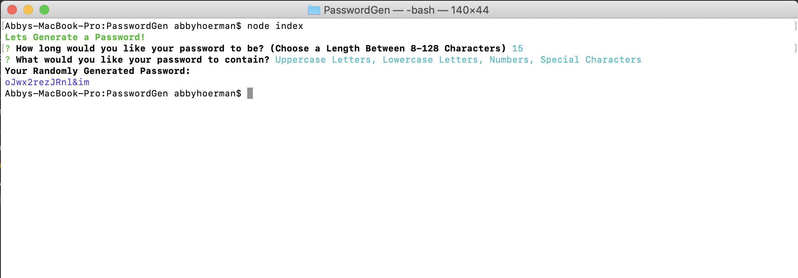

# CLI Password Generator

 This CLI application allows you to generate a random password of a length of your choosing. It also allows you to pick what kind of characters you would like included.

 ***

 

 ***
    
## Table of Contents
[Installation](#Installation)

[Usage](#Usage)
    
[Licensing](#Licensing)
    
***
    
## Installation
npm install, npm install chalk

## Usage
Run required installs, then run the application in your command line. Follow the prompts to create your desired password.
    
## Licensing
No License
    
    
***
    
### Email: awhoerman@me.com

    